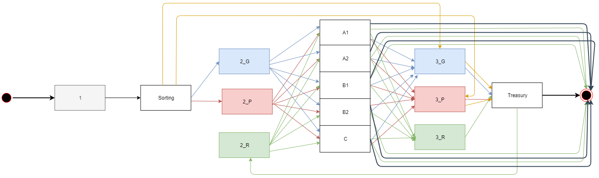

# Finances-Queue-CC
A small Java project to simulate queues

## Main Ideia:

### Agents
- Clients
- Sorting
- A1
- A2
- B1
- B2
- C
- Treasury

### Queues
- raw_clients
- clients (phase 1)
- queue_1_p (phase 1)
- queue_1_g (phase 1)
- queue_2_p (phase 2)
- queue_2_g (phase 2)
- queue_2_r (phase 2)
- queue_3_p (phase 3)
- queue_3_g (phase 3)
- queue_3_r (phase 3)

### Statical Variables
- TTE (_Tempo Total de Espera_)
- QT (_Quantidade de Clientes_)
- TME (_Tempo Médio de Espera_)

## TODO:

- [x] Generate the clients queue
- [x] Order the clients queue by reach time
- [x] Making of Sorting
- [ ] Making of As
- [ ] Making of Bs
- [ ] Making of C
- [ ] Making of Treasury
- [ ] Get the Statical Variable